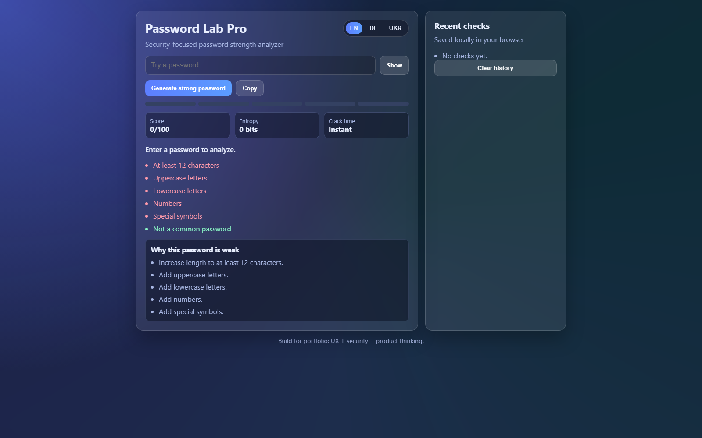

# Password Lab Pro

Modern password strength analyzer built with vanilla HTML, CSS, and JavaScript.

## Why this project stands out

- Product-focused UX + security logic (balanced portfolio direction)
- Multilingual UI: English, German, Ukrainian
- Security-oriented logic: entropy estimate + crack-time simulation
- Utility features: password generator, copy action, show/hide toggle
- Local persistence: recent checks history saved in browser storage
- Portfolio-ready UI: animated wow-style glass dashboard + responsive layout

## Features

- 0-100 score
- 5-segment visual meter
- Entropy (bits) and crack time estimate
- Common password warning
- Live policy checklist
- "Why weak" insights with actionable suggestions
- Generate strong password
- Save and clear recent checks

## Tech stack

- HTML5
- CSS3
- Vanilla JavaScript (ES6+)

## Run locally

1. Clone the repo
2. Open `lst.html` in your browser

## Screenshot

Add your screenshot to `assets/screenshot.png` and keep this section:

## Suggested GitHub description

`Password Lab Pro — multilingual password strength analyzer with 0-100 score, entropy, crack-time estimate, weak-password insights, and generator (Vanilla JS).`

## Roadmap (mini-product direction)

- Add breach-check API integration (demo mode toggle)
- Add custom policy builder (enterprise-friendly)
- Add export/share report for security awareness demos

